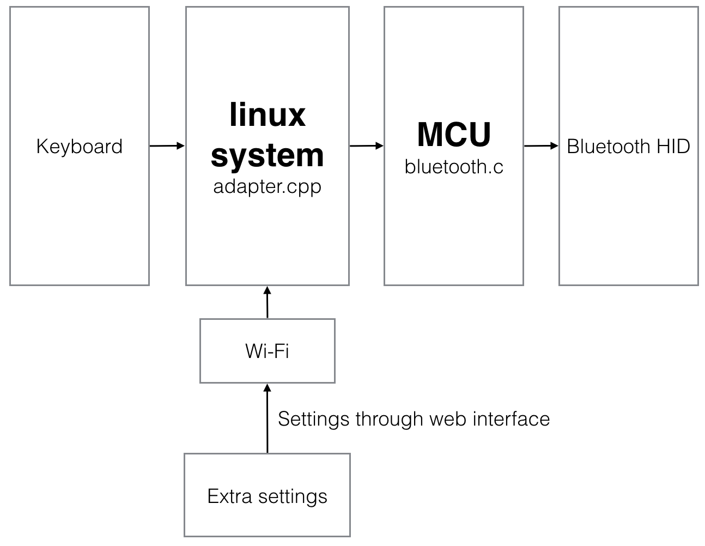

# Bluetooth-keyboard-adapter
This project is based on Linkit smart 7688 Duo board, but is compatible with other boards with some modifications.

I really like to use my [KBP mini V60](https://www.facebook.com/media/set/?set=a.870489189643222.1073741835.316701428355337&type=3) mechanical keyboard, And I've wondered is there a Bluetooth adapter that can enhance this keyboard into a Bluetooth wireless keyboard. There are some products like [ATEN CS533](http://www.aten.com.tw/products/手持式裝置週邊與USB/TapUSB轉Bluetooth鍵盤滑鼠切換器/~CS533.html#.Vujzw8eLTcY), but there are issues saying that they are not compatible with some mechanical keyboards, so I decided to build my own Bluetooth keyboard adapter.

When [Raspberry pi zero](https://www.raspberrypi.org/products/pi-zero/) was released, it seems to be the best choice as the central part of the adapter, but pi zero is always out of stock, so when I found [Linkit smart 7688 (Duo)](http://home.labs.mediatek.com/hello7688/?gclid=Cj0KEQjw5Z63BRCLqqLtpc6dk7gBEiQA0OuhsLLn9KMJ94rh7Wxj8knOw5i-hPy-99o40BoDHnrRvdIaAvp18P8HAQ) is easier to buy now, I then decide to use this board as the adapter, and also, the Wi-Fi on 7688 gave me some more idea to build extra function in this project. Besides, MCU on 7688 Duo can separate the code which communicates with HID Bluetooth module into MCU, and ensure no interrupts in MPU will break the communication with Bluetooth module.

## Hardwares
* [Linkit Smart 7688 Duo](http://home.labs.mediatek.com/hello7688/?gclid=Cj0KEQjw5Z63BRCLqqLtpc6dk7gBEiQA0OuhsLLn9KMJ94rh7Wxj8knOw5i-hPy-99o40BoDHnrRvdIaAvp18P8HAQ)  
	This part can be replaced with raspberry pi, banana pi, etc as long as the board supports Serial read and write, and runs an linux system on it. You can choose it by yourself(offcourse you'll like your adapter as small as possible and energy saving!).
	
* [Bluefruit EZ-Key 12 input Bluetooth HID Keyboard Controller](https://www.adafruit.com/products/1535)  
	This is the most expensive part, there is also some HID Bluetooth modules you can choose, so you can modify the MCU code to communicate with the bluetooth module you choose.
	
* (optional) Arduino  
	If you use 7688 Duo, this part is already included, but if you use raspberry pi, and want to seperate the code which communicates with bluetooth module, you'll need an Arduino.
	
* Battery  
	You can use any batteries, or power bank as the power source, just make sure your board can work with it.
	
## Block Diagram
The main idea is this:

and Linkit it smart 7688 Duo already contains the Linux system, Wi-Fi, MCU parts!

