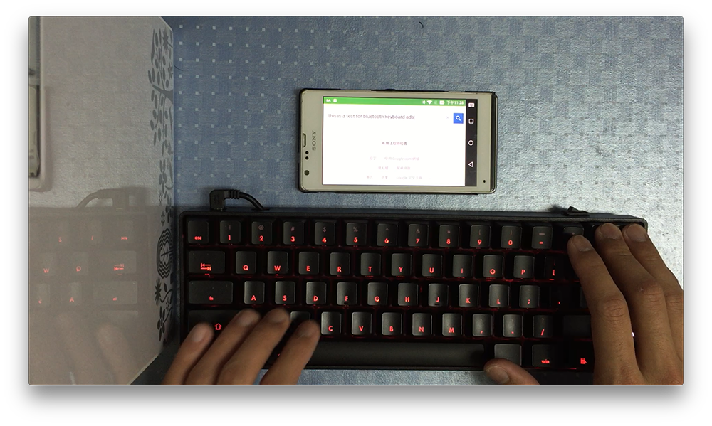
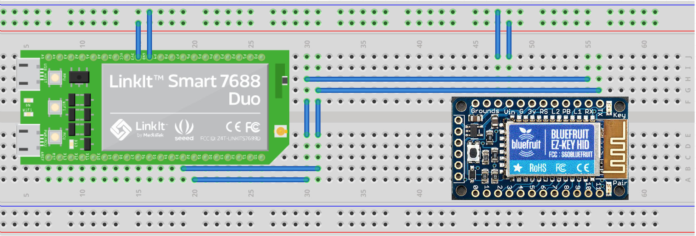

# Bluetooth-keyboard-adapter

### Duo to power consumption, heat dispation, start up time too long, etc issues, the development upon linkit smart 7688 duo is suspended, and will continue this project with arduino.

This project is based on Linkit smart 7688 Duo board, but is compatible with other boards with some modifications.

I really like to use my [KBP mini V60](https://www.facebook.com/media/set/?set=a.870489189643222.1073741835.316701428355337&type=3) mechanical keyboard, And I've wondered is there a Bluetooth adapter that can enhance this keyboard into a Bluetooth wireless keyboard. There are some products like [ATEN CS533](http://www.aten.com.tw/products/手持式裝置週邊與USB/TapUSB轉Bluetooth鍵盤滑鼠切換器/~CS533.html#.Vujzw8eLTcY), but there are issues saying that they are not compatible with some mechanical keyboards, so I decided to build my own Bluetooth keyboard adapter.

When [Raspberry pi zero](https://www.raspberrypi.org/products/pi-zero/) was released, it seems to be the best choice as the central part of the adapter, but pi zero is always out of stock, so when I found [Linkit smart 7688 (Duo)](http://home.labs.mediatek.com/hello7688/?gclid=Cj0KEQjw5Z63BRCLqqLtpc6dk7gBEiQA0OuhsLLn9KMJ94rh7Wxj8knOw5i-hPy-99o40BoDHnrRvdIaAvp18P8HAQ) is easier to buy now, I then decide to use this board as the adapter, and also, the Wi-Fi on 7688 gave me some more idea to build extra function in this project. Besides, MCU on 7688 Duo can separate the code which communicates with HID Bluetooth module into MCU, and ensure no interrupts in MPU will break the communication with Bluetooth module.

[Watch the test video on youtube](https://www.youtube.com/watch?v=QQ94N7vuD0M)

## Hardware
* [Linkit Smart 7688 Duo](http://home.labs.mediatek.com/hello7688/?gclid=Cj0KEQjw5Z63BRCLqqLtpc6dk7gBEiQA0OuhsLLn9KMJ94rh7Wxj8knOw5i-hPy-99o40BoDHnrRvdIaAvp18P8HAQ)  
	This part can be replaced with raspberry pi, banana pi, etc. as long as the board supports Serial read and write, and runs an Linux system on it. You can choose it by yourself(of course you'll like your adapter as small as possible and energy saving!).
	
* [Bluefruit EZ-Key 12 input Bluetooth HID Keyboard Controller](https://www.adafruit.com/products/1535)  
	This is the most expensive part, there is also some HID Bluetooth modules you can choose, so you can modify the MCU code to communicate with the Bluetooth module you chose. Also, be aware to the ability of the module you choose, some may not support HID customer reports, or some only sends English ASCII character, not implementing key press or release with keycode.  
	I found there is another good module, [RN-42HID bluetooth module](http://twcn.rs-online.com/web/p/bluetooth-modules/8417484/), and this one can be easily retrieved from RS site. It also supports [customer report](http://cdn.sparkfun.com/datasheets/Wireless/Bluetooth/RN-HID-User-Guide-v1.0r.pdf).

	
* (optional) Arduino  
	If you use 7688 Duo, this part is already included, but if you use raspberry pi, and want to separate the code which communicates with Bluetooth module, you'll need an Arduino. If you don't want to use a MCU to communicate with Bluetooth module, you can encode the communication into adapter.py, but if you do so, I strongly suggest you should deal timing issue carefully.
	
* Battery  
	You can use any batteries, or power bank as the power source, just make sure your board can work with it.  
	I used a battery from my old cell phone, and I used [this module](http://www.icshop.com.tw/product_info.php/products_id/18032) to boost voltage to 5V(this is imoprtant, though Linkit smart 7688 Duo can operates in 3.7V, which is the original battery output voltage, but if there is another load on 7688, I found that 7688 will fail and reboot while booting.), and [this module](http://www.icshop.com.tw/product_info.php/products_id/11427) to charge the battery.
	
## Block Diagram
The main idea is this:

and Linkit it smart 7688 Duo already contains the Linux system, Wi-Fi, MCU parts!

## Installation
### Linux system side
In order to read usb, 7688 (or other board) must has the ability to read a usb device.

run

    $ opkg update
    $ opkg install kmod-input-core
    $ opkg install kmod-input-evdev
    $ opkg install kmod-usb-hid
    $ opkg install usbutils
    $ opkg install libusb-1.0
    
to install prerequest packages. Now you're able to connect a usb keyboard, and run the command

    $ lsusb
    Bus 001 Device 001: ID 1d6b:0002 Linux Foundation 2.0 root hub
    Bus 002 Device 005: ID 04d9:0112 Holtek Semiconductor, Inc.
    Bus 002 Device 001: ID 1d6b:0001 Linux Foundation 1.1 root hub
    
and you'll found a different usb device name, that is your keyboard. Or, you can run

    $ lsusb -v
    ...
      iManufacturer           0
      iProduct                2 USB-HID Keyboard
      iSerial                 0
    ...
    
and if some patterns like USB-HID Keyboard, then your board is able to use the keyboard.

Then clone the [pyusb](https://github.com/walac/pyusb) in github(since pip install pyusb and pip install pyusb --pre report no match version, you can clone from the repository)

    $ git clone https://github.com/walac/pyusb
    $ cd pyusb
    $ python setup.py install
    
then you just installed the pyusb package. If you look into the adapter.py, you'll find that there is a weird code

    backend = usb.backend.libusb1.get_backend(find_library=lambda x: "/usr/lib/libusb-1.0.so")
    
This is because python in 7688 did not search the path /usr/lib, so I added manually. If your board do search this path or save libusb in other path, you should modify this part.

I strongly recommend to compile the pyton script to .pyc file, for this is more fast and may cause to less power consumption.  
To compile the python script, use the command below:

    python -m py_compile adapter.py
    
then you'll get a adapter.pyc file, and you can run it with

    python adapter.pyc
    
Next step, If you wish to automatically run this script after boot, add `python adapter.pyc` in `/etc/rc.local` If you use linkit smart 7688

    #!/bin/bash -e
    
    python adapter.pyc
    
    exit 0
    
and setup `/etc/rc.local` permissions:

    chmod 777 /etc/rc.local
    

### MCU part
Simply burn the .ino file in this project. Now I only released the .ino file for Bluefruit EZ-Key, and convert the raw customer report from usb to the formate Bluefruit EZ-Key accept, but if you use RN-42HID, I think you can simply send the USB data to RN-42, for RN-42 uses the same formate as USB HID data.

### Layout

pin 3 connected to Rx on bluetooh module, pin 2 connected to Tx on bluetooth

## HID Customer reports
This project also implemented HID customer reports(ex: the play hotkey on you keyboard), but depends on your keyboard model. I only have one keyboard with this function, and currently I am not familiar with HID customer reports function, so for some keyboard, hotkey may broken.

## License
The content of this project itself is licensed under the GNU General Public License