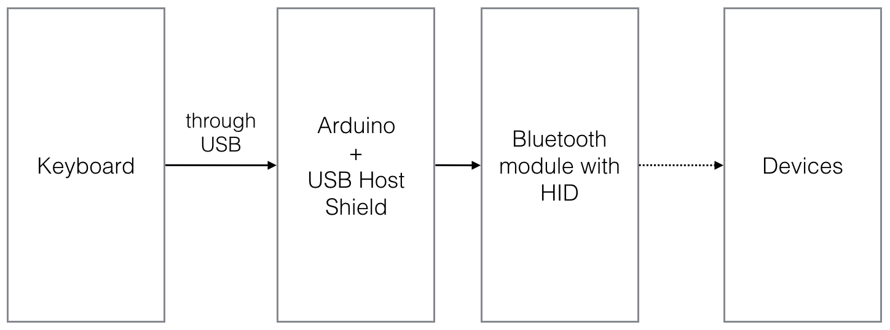
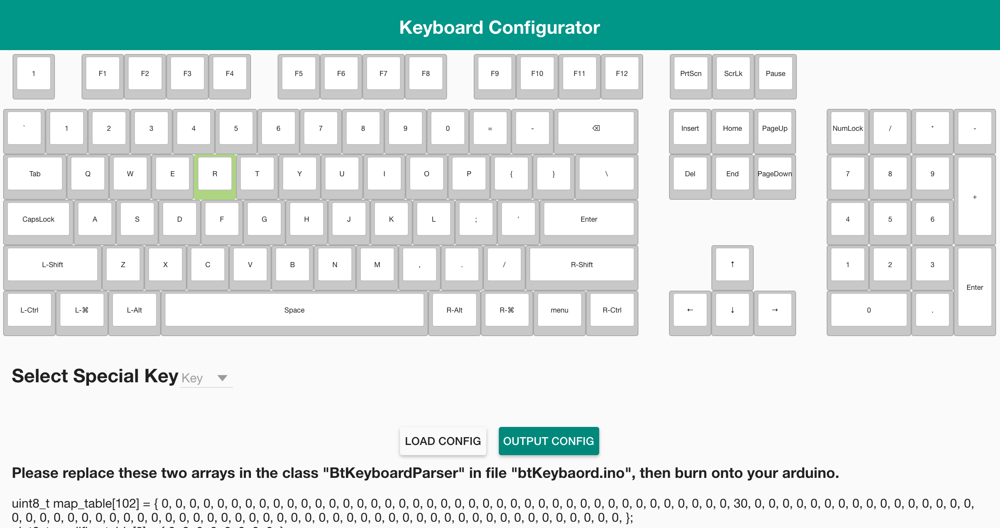

# Bluetooth-keyboard-adapter
This project is based on arduino nano broad, and is evolved from the old project which is based from linkit smart 7688 duo, you can still find the old project in the 'linkit\_smart\_7688\_duo\_version' directory.

I really like to use my [KBP mini V60](https://www.facebook.com/media/set/?set=a.870489189643222.1073741835.316701428355337&type=3) mechanical keyboard, And I've wondered is there a Bluetooth adapter that can enhance this keyboard into a Bluetooth wireless keyboard. There are some products like [ATEN CS533](http://www.aten.com.tw/products/手持式裝置週邊與USB/TapUSB轉Bluetooth鍵盤滑鼠切換器/~CS533.html#.Vujzw8eLTcY), but there are issues saying that they are not compatible with some mechanical keyboards, so I decided to build my own Bluetooth keyboard adapter.  
The bluetooth module I use can also support mouse simulation, so I also implement this feature in the project.

## Hardwares
* [Arduino boards](https://www.arduino.cc/)  
The board I used is [Arduino nano](https://www.arduino.cc/en/Main/ArduinoBoardNano)
(picture from [Arduino.cc](https://www.arduino.cc/en/Main/ArduinoBoardNano))  
The reason why I used it is because I will use an [arduino usb host shiled]() (list below), and I want to integrate them into my keyboard, so the smaller the better. You may ask why I don't use [arduino pro mini](https://www.arduino.cc/en/Main/ArduinoBoardProMini) with [arduino pro mini usb host shield](https://www.circuitsathome.com/products-page/arduino-shields/usb-host-shield-for-arduino-pro-mini), it is because the pro mini and mini shiled I bought is very weird ([here](https://github.com/felis/USB_Host_Shield_2.0/issues/239) is the thread I talked with the developer), so I gave up at last.

* [Arduino usb host shiled](https://www.circuitsathome.com/products-page/arduino-shields)  

(picture from [Circuits@Home](https://www.circuitsathome.com/products-page/arduino-shields/usb-host-shield-2-0-for-arduino))

* [Bluefruit EZ-Key 12 input Bluetooth HID Keyboard Controller](https://www.adafruit.com/products/1535)  

(picture from [Adafruit](https://www.adafruit.com/product/1535))  
This is the most expensive part, there is also some HID Bluetooth modules you can choose, so you can modify the MCU code to communicate with the Bluetooth module you chose. Also, be aware to the ability of the module you choose, some may not support HID customer reports, or some only sends English ASCII character, not implementing key press or release with keycode.  
	I found there is another good module, [RN-42HID bluetooth module](http://twcn.rs-online.com/web/p/bluetooth-modules/8417484/), and this one can be easily retrieved from RS site. It also supports [customer report](http://cdn.sparkfun.com/datasheets/Wireless/Bluetooth/RN-HID-User-Guide-v1.0r.pdf).
	
* Battery  
You can use any batteries, or power bank as the power source, just make sure your board can work with it.  
I used a battery from my old cell phone, and I used [this module](http://www.icshop.com.tw/product_info.php/products_id/18032) to boost voltage to 5V, and [this module](http://www.icshop.com.tw/product_info.php/products_id/11427) to charge the battery.

## Block Diagram
The main idea is this:

## Installation
### Install USB Host Shield Library
Just do the [installation process in your arduino IDE](https://www.arduino.cc/en/Guide/Libraries), and install [usb library](https://github.com/felis/USB_Host_Shield_2.0), then install [lightweight low power arduino library](http://www.rocketscream.com/blog/2011/07/04/lightweight-low-power-arduino-library/)  

Then copy these two files into the usb host shiled library directory:

* btHIDBoot.h
* btHIDBoot.cpp

In OSX, this directory is ususally at:

    ~/Documents/Arduino/libraries/USB_Host_Shield_Library_2.0
    
and in Windows, this directory is usually at:

    My Documents\Arduino\libraries\USB_Host_Shield_Library_2.0
    
### burn the btKeyboard.ino into your arduino
Open btKeyboard.ino with your arduino IDE, and burn it into your arduino board.  
btKeyboard.ino is the interface that I made for users to customize the behavior after receiving the keyboard down or up events.

### Pin Connections

* To connect the USB host shield, you should connect these pins:
	* 5V
	* 3.3V
	* 10 (SS)
	* 11 (MISO)
	* 12 (MOSI)
	* 13 (SCK)

* To connect the bluefruit ez-key module, you should connect these pins:

| Arduino | bluefruit ez-key | Note |
|---------|------------------|------|
| 2       | Tx               |      |
| 3       | Rx               |      |
| 4       | PB               | This pin is for re-pairing from arduino, you can drop this pin and do the re-pair by press the button on bluefruit module|
| 5V      | Vin              |      |
| GND     | GND              |      |

## Key Settings
In this version, I provided an configurator for remapping keys, but no macro configuration tools. 
The only combination I implemented in btKeyboard.ino is hold **r**, **s**, **t** (note that order does matter, and you have to hold them until you press the last t), then release these thess keys, your bluefruit will do the re-pair process.

## Configurator

To use this configurator, open the file **index.html** in the directory "configurator".  
You can click any key, and the press the corresponding key you wish to remap to. Then press "OUTPUT CONFIG", replace these two arrays appears at bottom, and burn onto your arduino.

### Output and load configures
When you press the "OUPTUT CONFIG", your browser will download a file "keyboard_configure.dat". This file is just a JSON string, so do not burn this onto your arduino.  
You can press the "LOAD CONFIG" button to load your configure file, which is obtained from clicking "OUTPUT CONFIG" button.

## Consumer Report
In this version, the keyboard adapter can not get the original consumer report from keyboard, but can define other keys to send consumer report. In the default settings in btKeyboard.ino file:

| Original Key | Maped to Consumer Report |
|--------------|--------------------------|
| F1           | Volume Up                |
| F2           | Volume Down              |
| F5           | Play/Pause               |
| F6           | Stop                     |
| F7           | Home                     |
| F8           | Search                   |

and In the feature, there will be a more convenient configure interface. Any one wants to implement another key map, or to support some consumer report that bluefruit do not have should modify the btKeybaord.ino file.

## Simulate Mouse
Because bluefruit EZ-Key can simulate mouse input, so I implement this function into this project, and I can relief from move my hands to hold mouse for some simple click.

To simulate mouse input, in the default settings, press the key **F3**, you you will enter mouse mode. In this mode, up, down, left, right arrow keys will become mouse move with 15px, and you can hold the arrow key to continue moving. If you want a more precise mouse moving, e.g. a slower mouse move, hold the **F** key, then any arrow key will move to the coresponding directions with 2px.

In the mosue mode, your **Space** key will become mouse left click, and **menu** key will become mouse right click.

You can press the key **F3** again to leave mouse mode.

## Power Control
In this version, I added an arduino power control library, and turn off the following modules:

* ADC: this project requires no analog to digital or digital to analog.
* Timer2: timer2 is used for PWM.
* Timer1: timer1 is used for Servo library
* TWI

If you want to save more power, you can consider to [build your barebone arduino](https://www.youtube.com/watch?v=sNIMCdVOHOM).

## License
The content of the configurator is licensed under MIT license, and the rest content of this project is licensed under GPLv2.